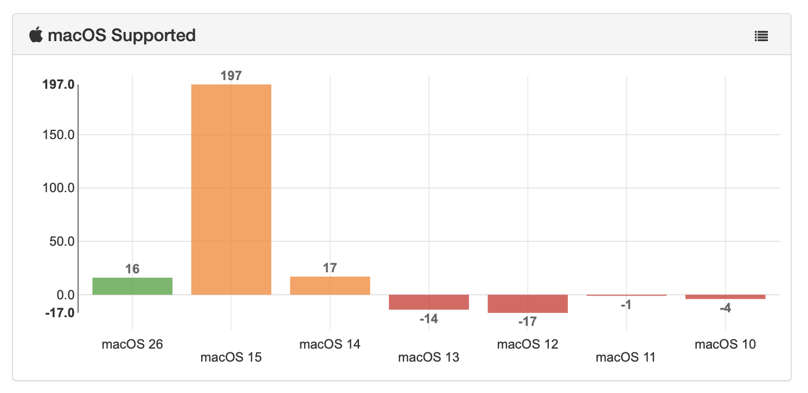

# os_supported_widget
A custom Supported OS bar graph Widget for munkireport

> v. 1.0.0  
> October 23, 2025  
> Alex Narvey / Precursor.ca



A custom Supported OS widget for MunkiReport 5 to display the information in a colored bar graph.
Using the currently supported OS derived from the munkireport supported OS module it will color the current Supported OS green.
n-1 and n-2 versions will be colored Orange. Any unsupported OSes will appear as negative numbers below the equator of the y axis and be colored Red.

No warrantee is offered. Neither express nor implied. Use at your own risk.

Place in:
```munkireport-php/local/views/widgets``` folder.

And call using a .yml file ```os_supported:```

See the munkireport wiki on custom dashbaoards at: 

https://github.com/munkireport/munkireport-php/wiki/Dashboards

## Updates
• October 23, 2025 Version 1.0.0

## Contributors
• Alex Narvey

— Alex Narvey 

precursor.ca
